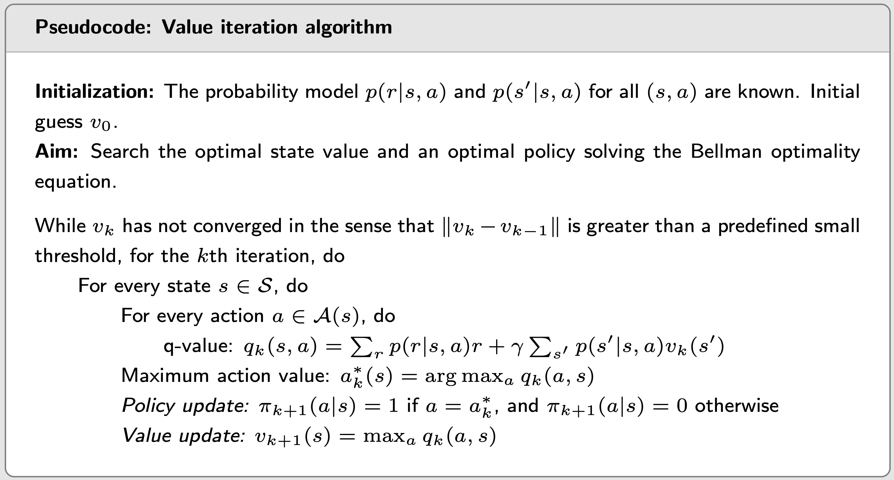
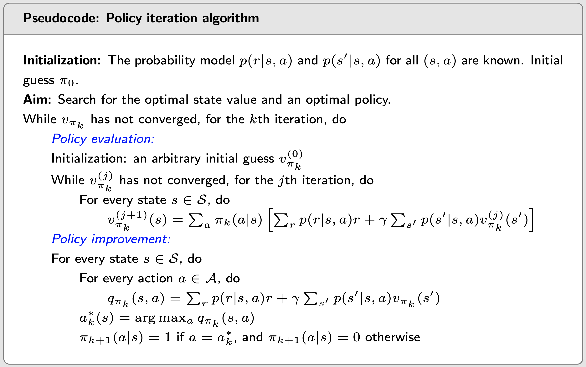
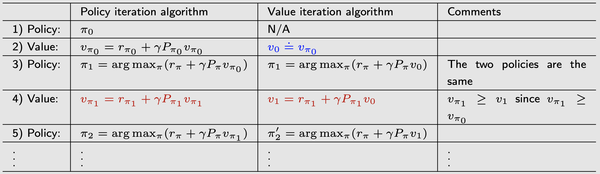
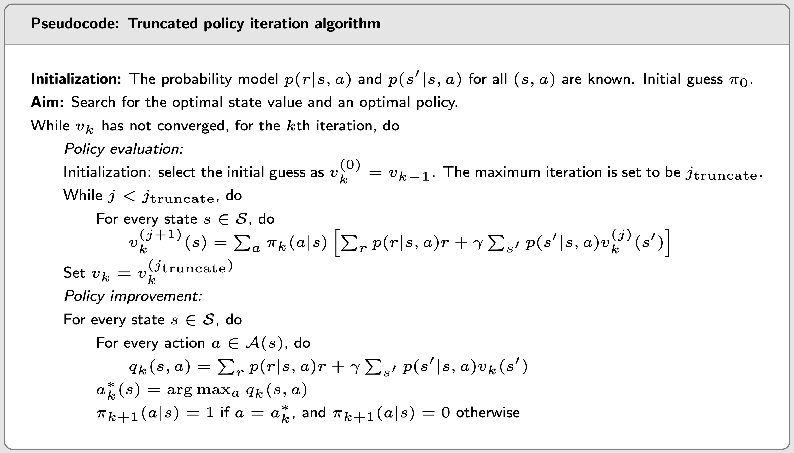

# Value Iteration and Policy Iteration

## Value iteration

- Two steps:
  1. policy update: $\pi_{k+1} = \text{argmax}_{\pi}(r_{\pi} + \gamma P_{\pi}v_k)$, where $v_k$ is given (obtained in the previous step).
  2. value update: $v_{k+1} = r_{\pi_{k+1}} + \gamma P_{\pi_{k+1}} v_k$
- Matrix-vector form is useful for **theoretical analysis**.
- Elementwise form is useful for **implementation**.

### Elementwise form and implementation

- Two steps

  1. Policy update: greedy policy
     $$
     \pi_{k+1}(a|s) = 
     \begin{cases}
     1 & a = a^*_k(s) \\
     0 & a \neq a^*_k(s)
     \end{cases}, \text{ where } a^*_k(s) = \text{argmax}_a q_k(a, s)
     $$
     
  2. Value update: $v_{k+1}(s) = \sum_a \pi_{k+1}(a|s) q_k(s,a), s \in \mathcal S$. Since $\pi_{k+1}$ is greedy, it's simply
     $$
     v_{k+1}(s) = \max_a q_k(a,s)
     $$
  
- Procedure: $v_k(s) \rightarrow q_k(s, a) \rightarrow \text{greedy policy } \pi_{k+1}(a|s) \rightarrow \text{new value } [v_{k+1} = \max_a q_k(s, a)]$

-  Value iteration algorithm:

  

 

## Policy iteration

### Algorithm analysis

- Two steps:

  1. policy evaluation (PE): calculate the state value of $\pi_k$:
     $$
     v_{\pi_k} = r_{\pi_k} + \gamma P_{\pi_k} v_{\pi_k}
     $$

  2. policy improvement (PI):
     $$
     \pi_{k+1} = \text{argmax}_{\pi} (r_{\pi} + \gamma P_{\pi} v_{\pi_k})
     $$

- Remarks

  - Policy iteration is an iterative algorithm with another iterative algorithm embedded in the policy evaluation step.
  - Policy Improvement: If $\pi_{k+1} = \text{argmax}_{\pi} (r_{\pi} + \gamma P_{\pi} v_{\pi_k})$, then $v_{\pi_{k+1}} \geq v_{\pi_k}$ for any $k$.
  - Convergence of Policy Iteration: The state value sequence $\{v_{\pi_k}\}_{k=0}^{\infty}$ generated by the policy iteration algorithm converges to the optimal state value $v^*$. As a result, the policy sequence $\{\pi_k\}_{k=0}^{\infty}$ converges to an optimal policy.

### Elementwise form and implementation

- Two steps:

  1. policy evaluation (PE):

     - Matrix-vector form:
       $$
       v_{\pi_k}^{(j+1)} = r_{\pi_k} + \gamma P_{\pi_k} v_{\pi_k}^{(j)}, j = 0,1,2,...
       $$

     - Elementwise form:
       $$
       v_{\pi_k}^{(j+1)} (s) = \sum_a \pi_k (a|s) \big(\sum_r p(r|s,a)r + \gamma \sum_{s'} p(s'|s, a) v_{\pi_k}^{(j)}(s') \big), s \in \mathcal S
       $$

  2. policy improvement (PI):
     $$
     \pi_{k+1}(s) = \text{argmax}_{\pi} \sum_a \pi(a|s) q_{\pi_k}(s,a), s \in \mathcal S
     $$

     - Let $a_k^* (s) = \text{argmax}_a q_{\pi_k}(a, s)$, the greedy policy is:
       $$
       \pi_{k+1}(a|s) = 
       \begin{cases}
       1 & a = a^*_k (s), \\
       0 & a \neq a^*_k (s).
       \end{cases}
       $$

- Policy iteration algorithm

  

 

## Truncated policy iteration

### Comparing value iteration and policy iteration

- compare the steps:

  - They start from the same initial condition.
  - The first three steps are the same.
  - The 4th step becomes different:
    - policy iteration requires an iterative algorithm (an infinite number of iterations)
    - value iteration is a one-step iteration.
  
  
  

 

### Truncated policy iteration algorithm

- Truncated policy iteration algorithm:

  

 

