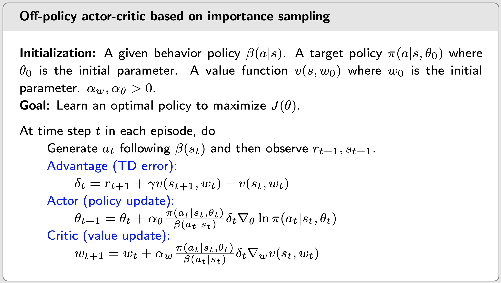

# Actor-Critic Methods

- Actor-critic methods are still policy gradient methods.
- “actor” refers to policy update. “critic” refers to policy evaluation or value estimation.

## Q Actor-Critic (QAC)

- The stochastic gradient-ascent algorithm: $\theta_{t+1} = \theta_t + \alpha \nabla_{\theta} \ln \pi(a_t | s_t,\theta_t) q_t(s_t, a_t)$
  - This expression corresponds to **actor**
  - The algorithm estimating $q_t(s,a)$ corresponds to **critic**
- We have studied two ways to estimate action values:
  - Monte Carlo learning: REINFORCE or Monte Carlo policy gradient
  - Temporal-difference learning: actor-critic
- Q Actor-Critic (QAC) algorithm: TODO

## Advantage actor-critic (A2C)

- The core idea is to introduce a baseline to reduce variance.

- Property: the policy gradient is invariant to an additional baseline:
  $$
  \nabla_{\theta}J(\theta) = \mathbb E_{S \sim \eta, A \sim \pi} [\nabla_{\theta} \ln \pi(A|S, \theta_t) q_{\pi}(S,A)] \\
  = \mathbb E_{S \sim \eta, A \sim \pi} \big[\nabla_{\theta} \ln \pi(A|S, \theta_t) [q_{\pi}(S,A) - b(S)]\big]
  $$

  - the additional baseline $b(S)$ is a scalar function of $S$.

- The gradient is $\nabla_{\theta}J(\theta) = \mathbb E[X]$, where $X(S, A) \triangleq \nabla_{\theta} \ln \pi(A|S, \theta_t) [q_{\pi}(S,A) - b(S)]$.

  - $\mathbb E(X)$ is invariant to $b(S)$.
  - $\text{var} (X)$ is NOT invariant to $b(S)$.

- Our goal: Select an optimal baseline $b$ to minimize $\text{var}(X)$.

  - The optimal baseline: TODO
  - The suboptimal baseline: $b(s) = \mathbb E_{A \sim \pi}[q_{\pi}(s, A)] = v_{\pi}(s)$, which is the state value of $s$.

- When $b(s) = v_{\pi}(s)$

  - The gradient-ascent algorithm is:
    $$
    \theta_{t+1} = \theta_t + \alpha \mathbb E \big[\nabla_{\theta} \ln_{\pi}(A|S, \theta_t)[q_{\pi}(S, A) - v_{\pi}(S)] \big] \\
    \triangleq \theta_t + \alpha \mathbb E \big[\nabla_{\theta} \ln_{\pi}(A|S, \theta_t) \delta_{\pi}(S, A) \big]
    $$

  - whre $\delta_{\pi}(S, A) \triangleq q_{\pi}(S, A) - v_{\pi}(S)$ is called **advantage function**.

  - Furthermore, the advantage function is approximated by the TD error: $\delta_t = q_t(s_t, a_t) - v_t(s_t) \rightarrow r_{t+1} + \gamma v_t(s_{t+1}) - v_t(s_t)$, only need one network to approximate $v_{\pi}(s)$.

- Advantage actor-critic (A2C) or TD actor-critic

  - Interpretation: TODO
  - It is on-policy

## Off-policy actor-critic

- Policy gradient is on-policy. We can convert it to off-policy by **importance sampling**.

### Importance sampling

- We can estimate $\mathbb E_{X\sim p_0} [X]$ by estimating $\mathbb E_{X\sim p_1} [F(X)]$:
  $$
  \mathbb E_{X\sim p_0} [X] = \sum_x p_0(x)x = \sum_x p_1(x) \underbrace{\frac{p_0(x)}{p_1(x)}x}_{f(x)} = \mathbb E_{X\sim p_1} [F(X)]
  $$

  - $\mathbb E_{X\sim p_0} [X] \approx \frac{1}{n} \sum_{i=1}^n \frac{p_0(x_i)}{p_1(x_i)} x_i$, where $\frac{p_0(x_i)}{p_1(x_i)}$ is called importance weight.

- Off-policy policy gradient theorem: In the discounted case where $\gamma \in (0, 1)$, the gradient of $J(\theta)$ is:
  $$
  \nabla_{\theta}J(\theta) = \mathbb E_{S \sim \rho, A \sim \pi} [\nabla_{\theta} \ln \pi(A|S, \theta)q_{\pi}(S,A)] \\
  = \mathbb E_{S \sim \rho, A \sim \beta} [\frac{\pi(A|S, \theta)}{\beta(A|S)}\nabla_{\theta} \ln \pi(A|S, \theta)q_{\pi}(S,A)]
  $$

  - where $\beta$ is the behavior policy and $\rho$ is a state distribution.

- The off-policy policy gradient is also invariant to a baseline $b(s)$.

- The algorithm of off-policy actor-critic:

  

 

## Deterministic actor-critic (DPG)

- TODO

